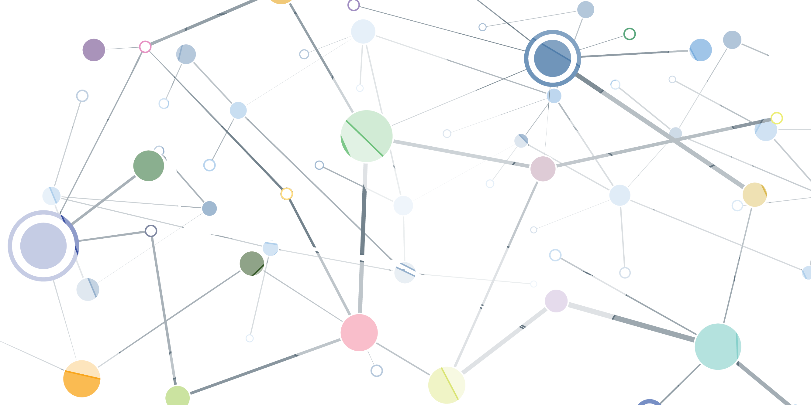

# Statement and Resources

## Diversity statement template

> Recent work in neuroscience and other fields has identified a bias in citation practices such that papers from women and other minorities are under-cited relative to the number of such papers in the field [1, 2, 3, 4, 5, 6]. Here we sought to proactively consider choosing references that reflect the diversity of the field in thought, form of contribution, gender, and other factors. We used automatic classification of gender based on the first names of the first and last authors [1], with possible combinations including male/male, male/female, female/male, and female/female. Excluding self-citations to the first and last authors of our current paper, the references contain X% male/male, Y % male/female, Z% female/male, A% female/female, and B% unknown categorization. We look forward to future work that could help us to better understand how to support equitable practices in science.

See [J. D. Dworkin, K. A. Linn, E. G. Teich, P. Zurn, R. T. Shinohara, and D. S. Bassett (2020). bioRxiv. doi: https://doi.org/10.1101/2020.01.03.894378](https://www.biorxiv.org/content/10.1101/2020.01.03.894378v1.full.pdf)

## Additional resources

For gender base-rates of neuroscience, see this [poll of SfN attendees from 2014-2018](https://biaswatchneuro.com/base-rates/neuroscience-base-rates/). Data for several subfields are available, such as audition, brain stimulation, cognitive neuro, computational neuro, computational psychiatry, neurally-inspired ML, pain, and reinforcement learning. 

For a template diversity statement .pdf and .tex, see the /diversityStatement directory.

# Instructions to calculate gender proportions

## .bib file

The only required file you need is your bibliography in .bib format. 

1. Check that your .bib file only contains references that you have used in your text. If you are using LaTeX, [use the checkcites function](https://github.com/cereda/checkcites)

    If you are not using LaTeX, export your bibliography in .bib format using your reference manager of choice (Mendeley, Zotero, EndNote, etc.)

## Binder

2. Start the Binder environment.

    

3. Upload your bib file to the Jupyter notebook environment (Upload button top-right). 

    NOTE: after selecting which file to upload, you will need to press the new Upload button that has appeared in the directory interface.

4. Open cleanBib.ipynb (will open in a new tab/window) and run the code. 

    OPTIONALLY: replace the instances of 'LastName, FirstName' in lines 5 and 6 (view line numbers by typing Ctrl+M and then L) strings with the names of your first author and last author. The code will check for self-citations in the provided author lists. 

    NOTE: if your author lists are not complete (e.g. your bibliography entry truncates the author list with 'et al.' or 'and Others', then you will need to manually edit the bibliography entry to include all author names). Also note that co-first or co-senior authors will not be accounted for by the code.

5. Go to the previous tab showing the Jupyter notebook directory files. Check the output called cleanedBib.csv. If there are missing cells under First Author (FA) or Last Author (LA), then check that your .bib file has names for those entries (common causes for blank cells are 'et al.' or 'and Others'). Formatting errors may also be caused by non-standard characters--those names should be manually inputted. For convenient searching of full bibliographies and author names, article titles have been printed in the column "Title" of cleanedBib.csv. If needed, remove the current version of the .bib file and upload the corrected version. Run the code in cleanBib.ipynb again until satisfied with the output. 

6. Save the output cleanedBib.csv. (Check the box of the row for cleanedBib.csv and press Download)

    OPTIONALLY: Delete rows in cleanbedBib.csv that indicate self-citations (download and re-upload modified cleanedBib.csv as needed). In the column 'SelfCite', 'Y' indicates the presence of a self-citation, 'N' indicates the absence of a self-citation, and 'NA' indicates that first and last author names of your paper were not provided in lines 5 and 6. 

7. Open getReferenceGends.ipynb. In the new window's menu bar, click on Kernel > Change kernel > R

8. On line 14 (view line numbers by typing Ctrl+M and then L), define the genderAPI_key with your [free gender-api account](https://gender-api.com/). Once registered and logged in, [find your 18-character API key at the bottom of this page](https://gender-api.com/en/account/overview#my-api-key). 

    NOTE: your free account has 500 queries per month. Re-running all code repeatedly will repeatedly use these credits. 

9. Run code in the first box/section. 

    NOTE: this box contains the code that will use your limited credits/queries. 

10. Run code in the second box/section. The output will provide a frequency count for male-male, male-female, female-male, and female-female. Your reference proportions will be displayed next to expected proportions in the field of neuroscience. Proportion difference relative to expected proportions will be printed.

    OPTIONALLY: Modify Authors.csv, re-upload your manually modified Authors.csv, uncomment #names<-read.csv('Authors.csv'), and rerun the second box/section. 

    NOTE: running just this box will not use your limited credits/queries.

# References

.bib file containing these references can be found in /diversityStatement/bibfile.bib

[1] J. D. Dworkin, K. A. Linn, E. G. Teich, P. Zurn, R. T. Shinohara, and D. S. Bassett, “The extent and drivers of gender imbalance in neuroscience reference lists,” bioRxiv, 2020.

[2] D. Maliniak, R. Powers, and B. F. Walter, “The gender citation gap in international relations,” International Organization, vol. 67, no. 4, pp. 889– 922, 2013.

[3] N. Caplar, S. Tacchella, and S. Birrer, “Quantitative evaluation of gender bias in astronomical publications from citation counts,” Nature Astronomy, vol. 1, no. 6, p. 0141, 2017.

[4] P. Chakravartty, R. Kuo, V. Grubbs, and C. McIlwain, “# communicationsowhite,” Journal of Communication, vol. 68, no. 2, pp. 254–266, 2018.

[5] Y. Thiem, K. F. Sealey, A. E. Ferrer, A. M. Trott, and R. Kennison, “Just Ideas? The Status and Future of Publication Ethics in Philosophy: A White Paper,” tech. rep., 2018.

[6] M. L. Dion, J. L. Sumner, and S. M. Mitchell, “Gendered citation patterns across political science and social science methodology fields,” Political Analysis, vol. 26, no. 3, pp. 312–327, 2018.

# Changelog

1/19/2020 - added code to output a column with article titles to make it easier to manually search which bib entries need manual editing. Also added code to output another column that optionally checks for self-citations. 