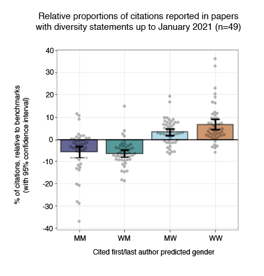

# Table of Contents

* [Diversity Statement and Code Notebook](https://github.com/dalejn/cleanBib#diversity-statement-and-code-notebook)

  - [Diversity statement template](https://github.com/dalejn/cleanBib#diversity-statement-template)

    + [Template](https://github.com/dalejn/cleanBib#template)

    + [Benchmark across neuroscience](https://github.com/dalejn/cleanBib#benchmark-across-neuroscience)

    + [Benchmark for papers using this tool](https://github.com/dalejn/cleanBib#benchmark-for-papers-using-this-tool)

* [Instructions](https://github.com/dalejn/cleanBib#instructions)

  - [Input/output](https://github.com/dalejn/cleanBib#inputoutput)

* [FAQ](https://github.com/dalejn/cleanBib#faq)

* [Other Resources](https://github.com/dalejn/cleanBib#other-resources)

  - [Papers](https://github.com/dalejn/cleanBib#papers)

  - [Journal Guidelines](https://github.com/dalejn/cleanBib#journal-guidelines)

  - [Lists and Databases](https://github.com/dalejn/cleanBib#lists-and-databases)

  - [Code](https://github.com/dalejn/cleanBib#code)

  - [Related Projects](https://github.com/dalejn/cleanBib#related-projects)

* [References](https://github.com/dalejn/cleanBib#references)

* [Contributors](https://github.com/dalejn/cleanBib#contributors)

* [Changelog](https://github.com/dalejn/cleanBib#changelog)

# Diversity Statement and Code Notebook

[](https://doi.org/10.5281/zenodo.7375227)

Motivated from work by:

 * J. D. Dworkin, K. A. Linn, E. G. Teich, P. Zurn, R. T. Shinohara, and D. S. Bassett (2020). The extent and drivers of gender imbalance in neuroscience reference lists. [*Nature Neuroscience*.](https://doi.org/10.1038/s41593-020-0658-y)

 * M.A. Bertolero, J.D. Dworkin, S.U. David, C. López Lloreda, P. Srivastava, J. Stiso, D. Zhou, K. Dzirasa, D.A. Fair, A.N. Kaczkurkin, B.J. Marlin, D. Shohamy, L.Q. Uddin, P. Zurn, D.S. Bassett (2020). Racial and ethnic imbalance in neuroscience reference lists and intersections with gender. [*bioRxiv*.](https://www.biorxiv.org/content/10.1101/2020.10.12.336230v1)

 * X. Wang, J.D. Dworkin, D. Zhou, J. Stiso, E.B. Falk, D.S. Bassett, P. Zurn, D.M. Lydon-Staley (2021). Gendered citation practices in the field of communication. [*Annals of the International Communication Association*.](https://www.tandfonline.com/doi/full/10.1080/23808985.2021.1960180)

See also these Perspectives with actionable recommendations moving forward for scientists at all levels:

* J. D. Dworkin, P. Zurn, and D. S. Bassett (2020). (In)citing Action to Realize an Equitable Future. [*Neuron*.](https://doi.org/10.1016/j.neuron.2020.05.011)
* P. Zurn, D.S. Bassett, and N.C. Rust (2020). The Citation Diversity Statement: A Practice of Transparency, A Way of Life. [*Trends in Cognitive Sciences*.](https://doi.org/10.1016/j.tics.2020.06.009)

And editorials and research highlights of this work:  

* A.L. Fairhall and E. Marder (2020). Acknowledging female voices. [*Nature Neuroscience*.](https://www.nature.com/articles/s41593-020-0667-x)  
* Widening the scope of diversity (2020). [*Nature Neuroscience*. ](https://www.nature.com/articles/s41593-020-0670-2)  
* Z. Budrikis (2020). Growing citation gender gap. [*Nature Reviews Physics*.](https://doi.org/10.1038/s42254-020-0207-3)
* D. J. Sweet (2021). New at cell press: the inclusion and diversity statement. [*Cell*.](https://www.sciencedirect.com/science/article/pii/S0092867420316895?via%3Dihub)
* B. Rowson, S.M. Duma, M.R. King, I. Efimov, A. Saterbak, and N.C. Chesler (2021). Citation diversity statement in BMES journals. [*Annals of Biomedical Engineering*.](https://link.springer.com/article/10.1007/s10439-021-02739-6)
* D. Kwon (2022). The rise of citational justice: how scholars are making references fairer. [*Nature*.](https://www.nature.com/articles/d41586-022-00793-1)
* C. Lopez Lloreda (2022). Women researchers are cited less than men. Here’s why—and what can be done about it. [*Science*.](https://www.science.org/content/article/women-researchers-cited-less-men-heres-why-what-can-done)

For `.pdf` and `.tex` templates of the statement, see the `/diversityStatement` directory in this repository.

A `.bib` file containing the references used in the statement can be found in `/diversityStatement/bibfile.bib`

## Diversity statement template

### Template

> Recent work in several fields of science has identified a bias in citation practices such that papers from women and other minority scholars are under-cited relative to the number of such papers in the field (1-9). Here we sought to proactively consider choosing references that reflect the diversity of the field in thought, form of contribution, gender, race, ethnicity, and other factors. First, we obtained the predicted gender of the first and last author of each reference by using databases that store the probability of a first name being carried by a woman (5, 10). By this measure (and excluding self-citations to the first and last authors of our current paper), our references contain `A`% woman(first)/woman(last), `B`% man/woman, `C`% woman/man, `D`% man/man, and `E`% unknown categorization. This method is limited in that a) names, pronouns, and social media profiles used to construct the databases may not, in every case, be indicative of gender identity and b) it cannot account for intersex, non-binary, or transgender people. Second, we obtained predicted racial/ethnic category of the first and last author of each reference by databases that store the probability of a first and last name being carried by an author of color [11, 12]. By this measure (and excluding self-citations), our references contain `F`% author of color (first)/author of color(last), `G`% white author/author of color, `H`% author of color/white author, and `I`% white author/white author. This method is limited in that a) names, Census entries, and Wikipedia profiles used to make the predictions may not be indicative of racial/ethnic identity, and b) it cannot account for Indigenous and mixed-race authors, or those who may face differential biases due to the ambiguous racialization or ethnicization of their names.  We look forward to future work that could help us to better understand how to support equitable practices in science.

### Benchmark across neuroscience

For the top 5 neuroscience journals (Nature Neuroscience, Neuron, Brain, Journal of Neuroscience, and Neuroimage), the expected gender proportions in reference lists as reported by [Dworkin et al.](https://doi.org/10.1038/s41593-020-0658-y) are 6.7% for woman(first)/woman(last), 9.4% for man/woman, 25.5% for woman/man, and 58.4% for man/man. Expected proportions were calculated by randomly sampling papers from 28,505 articles in the 5 journals, estimating gender breakdowns using probabilistic name classification tools, and regressing for relevant article variables like publication date, journal, number of authors, review article or not, and first-/last-author seniority. See [Dworkin et al.](https://doi.org/10.1038/s41593-020-0658-y) for more details.

Using a similar random draw model regressing for relevant variables, the expected race proportions in reference lists as reported by [Bertolero et al.](https://www.biorxiv.org/content/10.1101/2020.10.12.336230v1) were 51.8% for white/white, 12.8% for white/author-of-color, 23.5% for author-of-color/white, and 11.9% for author-of-color/author-of-color.

### Benchmark for papers using this tool

Papers with citation diversity statements tend to have more balanced reference lists with respect to the expected benchmarks. Prior to v1.1 (October 2020) of the code, the diversity statement only included predicted gender. Below, we show a preliminary visualization of the relative gender proportions in reference lists of papers with diversity statements (relative to the expected gender proportions) from January 2020 to January 2021. See the [cleanBibImpact repository](https://github.com/koudyk/cleanBibImpact) for the code and data for this ongoing project.



# Instructions

The goal of the coding notebook is to analyze the predicted gender and race of first and last authors in reference lists of *manuscripts in progress*. The code will clean your `.bib` file to only contain references that you have cited in your manuscript. This cleaned `.bib` will then be used to generate a data table of names that will be used to query the probabilistic gender ([Gender API](https://gender-api.com)) and race ([ethnicolr](https://github.com/appeler/ethnicolr)) database. Proportions of the predicted gender for first and last author pairs (man/man, man/woman, woman/man, and woman/woman) and predicted race (white and author of color) will be calculated using the database probabilities.

<details>

<summary>Can I use this code to analyze published article(s) instead of manuscripts in progress?</summary>
We recognize that you might be curious about your or others' <b>history</b> of citation practices. The main purpose of the notebook is to increase awareness of how you engage with your colleagues' research for works in progress, and to iteratively assess if your <b>current</b> citation practices align with your values. That being said, we are developing analysis of published papers as a secondary feature by using data acquired from Web of Knowledge. However, we caution that this analysis is still in development. This approach will build a table by relying heavily on an automated search using CrossRef API from a single field provided by Web of Science. It will also require more extensive manual edits to the created table because automated search often returns incomplete information. Currently, the code for this secondary feature only supports prediction of gender for published paper(s). When considering how many published papers to analyze, note that Gender-API provides only 500 free searches per month. We recommend analyzing one paper at a time, which is also important to check for self-citations within each paper. If you intend to analyze the reference list of a published paper instead of your own manuscript in progress:

___

  1. Search the paper on [Web of Knowledge](http://apps.webofknowledge.com/) (you will need institutional access).
  2. Next, [download the .bib file from Web of Science following these instructions, but start from Step 4 and on Step 6 select BibTeX instead of Plain Text](https://github.com/jdwor/gendercitation/blob/master/Step0_PullingWOSdata.pdf).
  3. Then, [launch Binder from this link](https://mybinder.org/v2/gh/dalejn/cleanBib/7ffe1823397a77c8c068b549c7b428c79379232e).
  4. Open the notebook `cleanBib.ipynb`. Follow the instructions above each code block. At the step where the instructions ask you to use `checkingPublishedArticle = True`, please run it using `checkingPublishedArticle = False` first. This will tell you if there are any errors in the .bib file that should be addressed. See FAQ for common errors.

  It can take 10 minutes to 1 hour complete all of the instructions, depending on the state and size of your `.bib` file. We expect that the most time-consuming step will be manually modifying the `.bib` file to find missing author names, fill incomplete entries, and fix formatting errors. These problems arise because automated methods of reference mangagers and Google Scholar sometimes can not retrieve full information, for example if some journals only provide an author's first initial instead of their full first name.
___

</details>

1. Obtain a `.bib` file of your manuscript's reference list. You can do this with common reference managers. __Please try to export your .bib in an output style that uses full first names (rather than only first initials) and using the full author lists (rather than abbreviated author lists with "et al.").__ If a journal only provides first initials, our code will try to automatically find the full first name using the paper title or DOI (this can typically retrieve the first name 70% of the time).

   * [Export `.bib` from Mendeley](https://blog.mendeley.com/2011/10/25/howto-use-mendeley-to-create-citations-using-latex-and-bibtex/)
   * [Export `.bib` from Zotero](https://libguides.mit.edu/ld.php?content_id=34248570)
    <details>
      <summary>Tips for Microsoft Word and Google Docs integration</summary>

     Set your citation style to [BibTex](https://www.zotero.org/styles?q=id%3Abibtex) in Word and Google docs, and copy the reference list into a `.bib` file. Make sure you edit `Zotero/styles/bibtex.csl`: change `et-al-min` and `et-al-first` to something large (like 100) to avoid the last author being listed as 'et al.' Remove the line `text variable="abstract" prefix=" abstractNote={" suffix="}"/>` to avoid the `.bib` file getting very large.
    </details> 

   * [Export `.bib` from EndNote](https://www.reed.edu/cis/help/LaTeX/EndNote.html). Note: Please export full first names by either [choosing an output style that does so by default (e.g. in MLA style)](https://canterbury.libguides.com/endnote/basics-output)
   * [Export `.bib` from Read Cube Papers](https://support.papersapp.com/support/solutions/articles/30000024634-how-can-i-export-references-from-readcube-papers-)

2. Launch the coding environment. Please refresh the page if the Binder does not load after 5-10 mins.

    [](https://mybinder.org/v2/gh/dalejn/cleanBib/HEAD?urlpath=/tree/)

3. Open the notebook `cleanBib.ipynb`. Follow the instructions above each code block. It can take 10 minutes to 1 hour complete all of the instructions, depending on the state and size of your `.bib` file. We expect that the most time-consuming step will be manually modifying the `.bib` file to find missing author names, fill incomplete entries, and fix formatting errors. These problems arise because automated methods of reference mangagers and Google Scholar sometimes can not retrieve full information, for example if some journals only provide an author's first initial instead of their full first name.

## Input/output

| Input                 | Output                                                                                                                        |
|-----------------------|-------------------------------------------------------------------------------------------------------------------------------|
| `.bib` file(s)**(REQUIRED)**    | `cleanedBib.csv`: table of author first names, titles, and .bib keys                                                            |
| `.aux` file (OPTIONAL)| `predictions.csv`: table of author first names, estimated gender classification, and confidence                                   |
| `.tex` file (OPTIONAL) | `race_gender_citations.pdf`: heat map of your citations broken down by probabilistic gender and race estimations
|                       | `yourTexFile_gendercolor.tex`: your `.tex` file modified to compile .pdf with in-line citations colored-coded by gender pairs |


# FAQ

<details>
  <summary>Why do I receive an error when running the code?</summary>

* The most common errors are due to misformatted .bib files. Errors messages are very detailed, and at the bottom of the printed message will be an indication of the line and type of problem in the .bib file. They will require you to manually correct the `.bib` file of formatting errors or incomplete entries. After editing the `.bib` file, try re-running the code block that gave you the error. If you cannot resolve an error, please open an [Issue](https://github.com/dalejn/cleanBib/issues/new/choose), paste the error text or a screenshot of the error, and attach the files that you used so that we can reproduce the error. We will try to help resolve it.
</details>

<details>
<summary>Common errors</summary>

<details>
<summary>TokenRequired</summary>

```TokenRequired: syntax error in line X: entry key expected```

This error message indicates that on line X of your uploaded .bib file, there is an incomplete entry that is missing a unique key for the citation. For instance, `@article{,` should be changed to `@article{yourUniqueCitationKey`
</details>

<details>
<summary>Syntax Error</summary>

```in line X: ‘Y‘ expected```

This error message could indicate that there is an unexpected character at line X of your .bib file, such as a space in the name of a field. For example, instead of `Early Access Date = …`, the field should be changed to `EarlyAccessDate = …`
</details>

<details>
<summary>Key Error</summary>

```KeyError: 'author'```

This error message could indicate that you have cited a book and there is no `author` field. In this case, if there is an `editor` field, please change `editor` to `author`. Otherwise, add the `author` metadata.
</details>

</details>

<details>
  <summary>What should I do if the Binder crashes, times out, or takes very long to launch?</summary>

* Please refresh the Binder or re-launch from our step 2 instruction upon a crash. This has often resolved the issue. The environment will time out if you are inactive for over 10 minutes (but leaving the window open counts as activity). Long launch times (>15 minutes) can be due to a recent patch by us (temporary slow-down from re-building the Docker image) or heavy load on the server. Please try again at a later time. Please refer to the [Binder User Guide](https://mybinder.readthedocs.io/en/latest/index.html) and [FAQ](https://mybinder.readthedocs.io/en/latest/index.html) for other questions.
</details>

<details>
  <summary>Will this method work on non-Western names and how accurate is it?</summary>

* Yes, the [Gender API supports 177 countries](https://gender-api.com/en/frequently-asked-questions?gclid=Cj0KCQiAmZDxBRDIARIsABnkbYTy9MHmGoR2uBhxEKANbT9B9EFVOSiRzbGeQi7nUn6ODH83s6-RZKwaAjpZEALw_wcB#which-countries-are-supported) but will classify genders with varying confidence. [Dworkin et al. (2020; Supplementary Tables 1 and 2)](https://doi.org/10.1038/s41593-020-0658-y) assessed the extent of potential gender mislabeling by manual inspecting a sample of 200 authors. They found that the relative accuracy of the automated determination procedure at the level of both individual authors had an accuracy ≈ 0.96 and article gender categories had an accuracy ≈ 0.92. Because errors in gender determination would break the links between citation behavior and author gender, any incorrect estimation in the present data likely biases the results towards the null. The [ethnicolr](https://github.com/appeler/ethnicolr) race probabilities use the last-name–race data from the [2000 census and 2010 census](https://github.com/appeler/ethnicolr/blob/master/ethnicolr/data/census), the [Wikipedia data](https://github.com/appeler/ethnicolr/blob/master/ethnicolr/data/wiki) collected by Skiena and colleagues, and the [Florida voter registration data](http://dx.doi.org/10.7910/DVN/UBIG3F) from early 2017. Across cross-validation folds, the average precision was 0.83, recall was 0.84, and f1-support scores were 0.83 for the Florida model. Please see this [confusion matrix for the accuracy and precision of the algorithm during cross-validation](https://github.com/mb3152/balanced_citer) and [Sood & Laohaprapanon (2018)](https://arxiv.org/abs/1805.02109).

</details>

<details>
  <summary>How are proportions calculated, especially when considering gender-neutral or race-ambiguous names?</summary>

* The proportions for predicted gender and race are now weighted probabilistically. For instance, if Gender-API predicts a name as man with 72% accuracy, then the 0.72 is added to the man proportion. The proportions are calculated from weighted sums across all author pairs. Similarly for predicted race, the ethnicolor package can be used to make binary predictions but also provides probabilities that an author belongs to each racial category. Consider the last name “Smith.” The model’s probabilities for the name “Smith” are 73% white, 25% Black, 1% Hispanic, and <1% Asian. We use all four probabilities to estimate how citers probabilistically assign racial categories to names, either implicitly or explicitly, while reading and citing papers. Note that imperfections in the algorithm’s predictions will break the links between citation behavior and author race, and therefore any incorrect estimation in the present data likely biases the results towards the null model.
</details>

<details>

<summary>Can I use this code to analyze published article(s) instead of manuscripts in progress?</summary>
We recognize that you might be curious about your or others' <b>history</b> of citation practices. The main purpose of the notebook is to increase awareness of how you engage with your colleagues' research for works in progress, and to iteratively assess if your <b>current</b> citation practices align with your values. That being said, we are developing analysis of published papers as a secondary feature by using data acquired from Web of Knowledge. However, we caution that this analysis is still in development. This approach will build a table by relying heavily on an automated search using CrossRef API from a single field provided by Web of Science. It will also require more extensive manual edits to the created table because automated search often returns incomplete information. Currently, the code for this secondary feature only supports prediction of gender for published paper(s). When considering how many published papers to analyze, note that Gender-API provides only 500 free searches per month. We recommend analyzing one paper at a time, which is also important to check for self-citations within each paper. If you intend to analyze the reference list of a published paper instead of your own manuscript in progress:

___

  1. Search the paper on [Web of Knowledge](http://apps.webofknowledge.com/) (you will need institutional access).
  2. Next, [download the .bib file from Web of Science following these instructions, but start from Step 4 and on Step 6 select BibTeX instead of Plain Text](https://github.com/jdwor/gendercitation/blob/master/Step0_PullingWOSdata.pdf).
  3. Then, [launch Binder from this link](https://mybinder.org/v2/gh/dalejn/cleanBib/7ffe1823397a77c8c068b549c7b428c79379232e?urlpath=/tree/).
  4. Open the notebook `cleanBib.ipynb`. Follow the instructions above each code block. At the step where the instructions ask you to use `checkingPublishedArticle = True`, please run it using `checkingPublishedArticle = False` first. This will tell you if there are any errors in the .bib file that should be addressed. See FAQ for common errors.

  It can take 10 minutes to 1 hour complete all of the instructions, depending on the state and size of your `.bib` file. We expect that the most time-consuming step will be manually modifying the `.bib` file to find missing author names, fill incomplete entries, and fix formatting errors. These problems arise because automated methods of reference mangagers and Google Scholar sometimes can not retrieve full information, for example if some journals only provide an author's first initial instead of their full first name.
___

</details>

<details>
  <summary>Are self-citations included?</summary>

* We do not include self-citations by default because we seek to measure engagement with and citation of other researchers' work. We define self-citations as those including your first or last author as a co-author.
</details>

<details>
  <summary>What if a reference has only 1 author?</summary>

* We count that author as both the first and last author.
</details>

<details>
  <summary>What if the author list includes a committee or consortium?</summary>

* Please use either the last named author or the lead of the committee/consortium.
</details>

<details>
  <summary>What if a reference has more than 1 first author or last author?</summary>

* We do not automatically account for these cases. If you are aware of papers with co-first or co-last authors, then you could manually add duplicate entries for each co-first or co-last author so that they are double-counted.
</details>

<details>
  <summary>Should I include the diversity statement references in the proportion calculations?</summary>

* Please do not include the diversity statement references. The descriptive statistic of primary interest is of your citation practices.
</details>

<details>
  <summary>What is a .bib file?</summary>

* The `.bib` file is a bibliography with tagged entry fields used by LaTeX to format a typesetted manuscript's reference list and its in-line citations. If you are not using LaTeX to write your manuscript, common reference managers that are linked to Microsoft Word or Google Docs also allow you to export `.bib` files (See Instructions, Step 1). When you are asked to edit the `.bib` file, this means that you should open the file with a text editor (if you want to edit your own copy of the file) or within the Binder environment (if you want to edit a temporary copy of your uploaded file). Each entry starts with an `@` symbol and includes a reference key, then lists metadata for author, year, journal, etc. Some instructions will ask you to edit the list of names in the "author" data, and some will ask you to remove entire entries.
</details>

<details>
  <summary>What is an .aux file?</summary>

* The `.aux` file is generated when you compile the `.tex` file to build your manuscript. It is linked to the `.bib` file(s) used to populate your manuscript's reference list and records the citations used.
</details>

<details>
  <summary>I have an idea to advance this project, suggestions about how to improve the notebook, and/or found a bug. Can I contribute? How do I contribute?</summary>

* If you have suggestions for changes, please open an `Issue` or `Pull Request`. We welcome feedback on any pain points in running this code notebook (there is an Issue in which you can submit feedback). If you want to contribute but don't know where to start, we keep a to-do list of self-opened issues that we intend to tackle and would welcome help. If you contribute, please don't forget to modify the `README.md` to credit yourself alphabetically in the `Contributors` section in the `pull request`.

* To modify the notebook cleanBib.ipynb, please:
1. Test the code works as intended and does not seem break any existing code (we can also help to check this later) by pasting it into the cleanBib.ipynb Jupyter notebook and running it in an active Binder session.
2. When you're confident it works as intended, copy the code again if you made any modifications from testing. Close/end the current Binder session, and start a fresh one to open the cleanBib.ipynb and do not run anything in this notebook (to remove traces of when you last ran it/how many times you've run the code). Go to File > Download As > Notebook (.ipynb).
3. [Create a fork of our GitHub repository to your own GitHub account.](https://docs.github.com/en/enterprise/2.13/user/articles/fork-a-repo#:~:text=A%20fork%20is%20a%20copy,point%20for%20your%20own%20idea.)
4. [Upload and commit your modified cleanBib.ipynb to your fork.](https://docs.github.com/en/enterprise/2.13/user/articles/adding-a-file-to-a-repository)
5. [Submit a Pull Request to our GitHub repository.](https://docs.github.com/en/github/collaborating-with-issues-and-pull-requests/creating-a-pull-request-from-a-fork)
</details>

# Other Resources

## Papers

* [Gender bias in (neuro)science: Facts, consequences, and solutions](https://doi.org/10.1111/ejn.14397).

* [Gender and collaboration patterns in a temporal scientific authorship network](https://appliednetsci.springeropen.com/articles/10.1007/s41109-019-0214-4)

* [Addressing the Gender Gap in Research: Insights from a Women in Neuroscience Conference](https://www.sciencedirect.com/science/article/pii/S0166223621000709)

## Journal Guidelines

* [Cell Press inclusion and diversity statement FAQ](https://www.cell.com/inclusion-diversity-statement-faqs)

## Lists and Databases

* Data on [speaker composition and gender representation of conferences in neuroscience](https://biaswatchneuro.com/about/).

* [Anneslist highlights woman neuroscientists](https://anneslist.net/). Categorized by subject area and seniority.

* The [Women in Neuroscience Repository](https://www.winrepo.org/) helps to identify and recommend women neuroscientists for conferences, symposia or collaborations.

* [Gender Citation Balance Index tool](https://postlab.psych.wisc.edu/gcbialyzer/)

## Code

* [R code used](https://github.com/jdwor/gendercitation) in J. D. Dworkin, K. A. Linn, E. G. Teich, P. Zurn, R. T. Shinohara, and D. S. Bassett (2020). The extent and drivers of gender imbalance in neuroscience reference lists. *Nature Neuroscience*. doi: [https://doi.org/10.1038/s41593-020-0658-y](https://doi.org/10.1038/s41593-020-0658-y)

* [Python code](https://github.com/mb3152/balanced_citer) used for probabilistic race breakdowns in M.A. Bertolero, J.D. Dworkin, S.U. David, C. López Lloreda, P. Srivastava, J. Stiso, D. Zhou, K. Dzirasa, D.A. Fair, A.N. Kaczkurkin, B.J. Marlin, D. Shohamy, L.Q. Uddin, P. Zurn, D.S. Bassett (2020). Racial and ethnic imbalance in neuroscience reference lists and intersections with gender. *bioRxiv*. [doi: https://doi.org/10.1101/2020.10.12.336230](https://www.biorxiv.org/content/10.1101/2020.10.12.336230v1)

## Related Projects

* The [cleanBibImpact](https://github.com/koudyk/cleanBibImpact) is an ongoing project looking at whether papers that have a citation diversity statement have more diverse reference lists.

# References

> [1] S. M. Mitchell, S. Lange, and H. Brus, “Gendered citation patterns in international relations journals,” International Studies Perspectives, vol. 14, no. 4, pp. 485–492, 2013.

> [2] D. Maliniak, R. Powers, and B. F. Walter, “The gender citation gap in international relations,” International Organization, vol. 67, no. 4, pp. 889– 922, 2013.

> [3] N. Caplar, S. Tacchella, and S. Birrer, “Quantitative evaluation of gender bias in astronomical publications from citation counts,” Nature Astronomy, vol. 1, no. 6, p. 0141, 2017.

> [4] M. L. Dion, J. L. Sumner, and S. M. Mitchell, “Gendered citation patterns across political science and social science methodology fields,” Political Analysis, vol. 26, no. 3, pp. 312–327, 2018.

> [5] J. D. Dworkin, K. A. Linn, E. G. Teich, P. Zurn, R. T. Shinohara, and D. S. Bassett, “The extent and drivers of gender imbalance in neuroscience reference lists,” Nature Neuroscience, 2020.

> [6] M. A. Bertolero, J. D. Dworkin, S. U. David, C. L. Lloreda, P. Srivastava, J. Stiso, D. Zhou, K. Dzirasa, D. A. Fair, A. N. Kaczkurkin, B. J. Marlin, D. Shohamy, L. Q. Uddin, P. Zurn, and D. S. Bassett, “Racial and ethnic imbalance in neuroscience reference lists and intersections with gender,” bioRxiv, 2020.

> [7] X. Wang, J. D. Dworkin, D. Zhou, J. Stiso, E. B. Falk, D. S. Bassett, P. Zurn, and D. M. Lydon-Staley, “Gendered citation practices in the field of communication,” Annals of the International Communication Association, 2021.

> [8] P. Chatterjee and R. M. Werner, “Gender disparity in citations in high- impact journal articles,” JAMA Netw Open, vol. 4, no. 7, p. e2114509, 2021.

> [9] J. M. Fulvio, I. Akinnola, and B. R. Postle, “Gender (im)balance in citation practices in cognitive neuroscience,” J Cogn Neurosci, vol. 33, no. 1, pp. 3–7, 2021.

> [10] D. Zhou, M. A. Bertolero, J. Stiso, E. J. Cornblath, E. G. Teich, A. S. Blevins, Virtualmario, C. Camp, J. D. Dworkin, and D. S. Bassett, “Gender diversity statement and code notebook v1.1,” Oct. 2020.

> [11] Ambekar, A., Ward, C., Mohammed, J., Male, S., & Skiena, S. (2009, June). Name-ethnicity classification from open sources. In Proceedings of the 15th ACM SIGKDD international conference on Knowledge Discovery and Data Mining (pp. 49-58).

> [12] Sood, G., & Laohaprapanon, S. (2018). Predicting race and ethnicity from the sequence of characters in a name. arXiv preprint arXiv:1805.02109.

# Contributors
(alphabetical)

* Raul Alcantara Castillo
* Dani Bassett
* Max Bertolero
* Ann Sizemore Blevins
* Christopher Camp
* Eli Cornblath
* Jordan Dworkin
* Jordan Matelsky
* Cleanthis Michael
* Kieran Murphy
* Kendra Oudyk
* Rebecca Saxe
* Jeni Stiso
* Erin Teich
* Anne Urai
* virtualmarioe
* Dale Zhou

# Changelog
* __11/28/2022__
  * major refactor (thanks, Jeni!)
  * removed SOS notebook
  * upgraded all packages and libraries
  * all R code now in Python
  * majority of code now call functions located in utils/
  * automate removal of identified duplicates and self-citations
  * query how many credits left and save some by only querying unique names (thanks, Kieran!)
  * fix the broken optional latex coloring
  * fixes issue introduced by [protobuf upgrade](https://github.com/protocolbuffers/protobuf/issues/10051)

* __9/14/2021__
  * force Binder to load with [classic theme](https://discourse.jupyter.org/t/mybinder-org-using-jupyterlab-by-default/10715) because new default breaks SOS notebook R code
  * suppress tensorflow warnings
  * add new citations to skip list
  * downgrade Jupyter client to play well with new Binder defaults

* __8/20/2021__
  * add new references to default printed statement template
  * add tips for Zotero 
  * add new papers and other resources

* __1/17/2021__
  * fix special character endcoding/decoding from latex
  * fix punctuation removal also removing dashes in names
  * link analysis to the bib global variable prepared earlier to improve behavior of .aux path. In future, could use this to try to automatically modify .bib file for the user instead of asking them to in step 3.
  * add common error. In future, could add try/except sequence for editor.
  * describe .bib better in FAQ
  * fix unknownname bug to unknownnames
  * added back LaTeX template of statement
  * fix typo in plain text statement "scholarsare"
  * delete some extraneous code

* __11/29/2020__
  * add common error
  * add other resources and reorganize into subsection headers
  * added back in a link to prior code to analyze the predicted gender of other published papers' reference lists
  * fix bug with histogram ordering of baserates for binary gender classification
  * update FAQs and description of proportions calculated by weighted probability
  * update instructions and error message text in ipynb


* __10/18/2020__
  * add predicted gender benchmarks for papers using this tool/with a diversity statement, thanks to Kendra for the work from [Organization for Human Brain Mapping Hackathon 2020](https://ohbm.github.io/hackathon2020/)!
  * add R code to plot the predicted gender balance compared to benchmarks, as in [Dworkin et al. (2020)](https://doi.org/10.1038/s41593-020-0658-y), thanks to Cleanthis for the work from [Organization for Human Brain Mapping Hackathon 2020!](https://ohbm.github.io/hackathon2020/)

* __10/13/2020__
  * update wiki to florida race data
  * update statement
  * update additional resources

* __9/30/2020__
  * add code for race probability
  * update diversity statement with race statement

* __7/5/2020__
  * update readme format
  * update other resources
  * update links to primary article, editorial, and highlights
  * add instructions for analyzing published paper(s) to new branch
  * add code for analyzing published paper(s) to new branch

* __6/12/2020__
  * modify statement, references, and acknowledgment of limitations

* __5/19/2020__
  * fix typos in readme
  * typo in warning for editing .bib instead of cleanedBib.csv
  * add flush.console() to give progress index for R code
  * added code to handle case one of the main gender pair categories has 0 references
  * add a savepoint for Authors.csv in codeblock for API query rather than just at the end
  * fix unknown category rounding
  * add extra escape backslashes to printed LaTeX template statement
  * changed to man/woman

* __5/1/2020__
  * fix bug with round function
  * add more informative string outputs to descriptive statistics code
  * add code to automatically output a template to copy-and-paste in both plain text and LaTeX with the percentages filled in
  * simplified instructions for descriptive statistics code
  * updated FAQ

* __4/9/2020__
  * fix bug with entry ID string matching for optional aux route, changed to regex
  * fix bug with duplicate check for optional aux route
  * added code to auto-remove the 7 references included in the diversity statement
  * add more descriptive instructions for the last section generating tables and comparing against benchmark
  * updated FAQ

* __3/16/2020__
  * fix bug with CrossRef title confirmation
  * add to README instructions on exporting .bib with a style that includes full first author (not just initials) when possible
  * added a sleep timer for CrossRef API queries
  * added another self-citation check from the CrossRef search results

* __2/17/2020__
  * streamlined instructions
  * added repository photo for social media (thanks, Ann!)
  * move instructions into Jupyter notebook
  * added code to automatically remove unused .bib entries instead of needing user to manually remove them (thanks, Eli and Erin!)
  * made removing self-citations default
  * added FAQ
  * added screenshots to instructions
  * added error message to request users remove entries with duplicate IDs. Not automated in case duplicate entry key refers to different references.
  * throw error if entries are incomplete or blank
  * fixed handling of optional middle initial correctly for self-citations
  * added SOS notebook support to put all code and instructions into 1 notebook so users don't have to manually change kernel
  * added optional entry for co-first or co-last authors
  * added optional code block to color-code `.tex` file's citation keys by gender pair classifications
  * added code to search `Crossref` API to automatically complete some incomplete `.bib` entries (thanks, Jeni!)
  * add another self-citation check after manual editing

* __1/19/2020__
  * added code to output a column with article titles to make it easier to manually search which bib entries need manual editing
  * added code to output another column that optionally checks for self-citations
